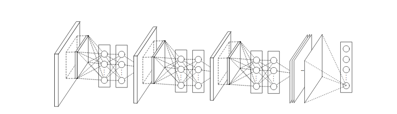
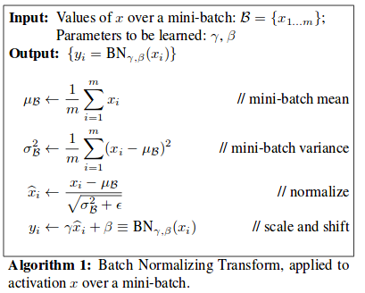
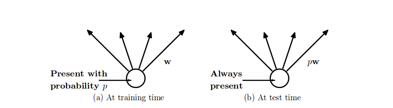
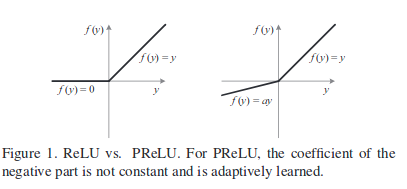
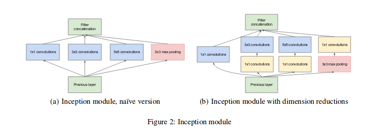
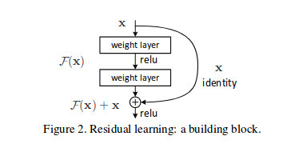

# computer_vision

## Papers

### To Read

#### Deep Learning Generic

* [On the importance of initialization and momentum in deep learning](http://proceedings.mlr.press/v28/sutskever13.pdf), ICML, 2013
* [Net2net: Accelerating learning via knowledge transfer](https://arxiv.org/pdf/1511.05641.pdf), ICLR, 2016
* [Network morphism](http://proceedings.mlr.press/v48/wei16.pdf), ICML, 2016
* [Intriguing properties of neural networks](https://arxiv.org/pdf/1312.6199.pdf), ICLR, 2014
* [Dynamic Routing Between Capsules](https://arxiv.org/pdf/1710.09829.pdf), NIPS, 2017

#### Generative Models for Vision

* [Generative adversarial nets](http://papers.nips.cc/paper/5423-generative-adversarial-nets.pdf), NIPS, 2014 [GAN]
* [Unsupervised Representation Learning with Deep Convolutional Generative Adversarial Networks](https://arxiv.org/pdf/1511.06434.pdf), ICLR, 2016 [DCGAN]
* [Conditional image generation with pixelcnn decoders](http://papers.nips.cc/paper/6527-conditional-image-generation-with-pixelcnn-decoders.pdf), NIPS,2016
* [PixelCNN++: Improving the PixelCNN with discretized logistic mixture likelihood and other modifications](https://arxiv.org/pdf/1701.05517.pdf), ICLR, 2016
* [Pixel recurrent neural networks](https://arxiv.org/pdf/1601.06759.pdf), ICML, 2016
* [InfoGAN](https://arxiv.org/pdf/1606.03657.pdf) NIPS,2016
* [Image Style Transfer Using Convolutional Neural Networks](https://www.cv-foundation.org/openaccess/content_cvpr_2016/papers/Gatys_Image_Style_Transfer_CVPR_2016_paper.pdf) ,CVPR, 2016 [Neural Style Transfer]
* [Real-Time Single Image and Video Super-Resolution Using an Efficient
Sub-Pixel Convolutional Neural Network](https://arxiv.org/pdf/1609.05158.pdf), CVPR, 2016
* [Improved Techniques for Training GAN](https://arxiv.org/pdf/1606.03498.pdf), NIPS, 2016
* [Wasserstein GAN](https://arxiv.org/abs/1701.07875)
* [Improved Training of Wasserstein GANs](https://arxiv.org/pdf/1704.00028.pdf), NIPS, 2017
* [Unsupervised Representation Learning with Deep Convolutional Generative Adversarial Networks](https://arxiv.org/pdf/1511.06434.pdf), ICLR, 2016
* [Least Squares Generative Adversarial Networks](https://arxiv.org/pdf/1611.04076.pdf), ICCV, 2017

#### Object Detection/Recognition/Segmentation

* [Scalable Object Detection Using Deep Neural Networks](https://arxiv.org/pdf/1312.2249.pdf), CVPR, 2014
* [Fast R-CNN](https://www.cv-foundation.org/openaccess/content_iccv_2015/papers/Girshick_Fast_R-CNN_ICCV_2015_paper.pdf) , ICCV, 2015
* [Faster R-CNN: Towards real-time object detection with region proposal networks](http://papers.nips.cc/paper/5638-faster-r-cnn-towards-real-time-object-detection-with-region-proposal-networks.pdf), NIPS, 2015
* [Mask R-CNN](https://arxiv.org/pdf/1703.06870.pdf), ICCV, 2017
* [You only look once: Unified, real-time object detection](https://www.cv-foundation.org/openaccess/content_cvpr_2016/papers/Redmon_You_Only_Look_CVPR_2016_paper.pdf), CVPR, 2016
* [Rich feature hierarchies for accurate object detection and semantic segmentation](https://www.cv-foundation.org/openaccess/content_cvpr_2014/papers/Girshick_Rich_Feature_Hierarchies_2014_CVPR_paper.pdf), CVPR, 2014
* [Segmentation as selective search for object recognition](https://www.koen.me/research/pub/vandesande-iccv2011.pdf), ICCV, 2011
* [SSD: Single shot multibox detector](https://arxiv.org/pdf/1512.02325.pdf), ECCV, 2016
* [Deep Inside Convolutional Networks: Visualising Image Classification Models and Saliency Maps](https://arxiv.org/pdf/1312.6034.pdf), CVPR, 2013
* [DenseCap: Fully Convolutional Localization Networks for Dense Captioning](https://arxiv.org/pdf/1511.07571.pdf), CVPR, 2016

### Read

#### Deep Learning Generic

* [Network In Network](https://arxiv.org/pdf/1312.4400.pdf), ICLR, 2014
  

    This paper proposes replacing feature maps with neural networks. The defined structure mlpconv, is an MLP which takes local patch as input and gives an output feature vector. The MLP operator is equivalent to the conventional 1x1 convolutional layer. Secondly the paper replaces the fully connected layers in the end of the network which global average pooling layers. The fully connected layers have a lot of parameters which need to be learned and they can easily overfit thus being less dependent on various regularisation tricks. 
    
  

* [Striving for Simplicity: The All Convolutional Net](https://arxiv.org/pdf/1412.6806.pdf), ICLR, 2014
    

        This paper analyses the basic design pipeline of CNN and proposes to replace the pooling layers with a convolutional layer with a non unit stride. The pooling layer can be seen as a convolutional layer with a p-norm operator being applied to each element instead of linear dot product. 
    

* [Deep Learning Using Linear Support Vector Machines](https://arxiv.org/pdf/1306.0239.pdf)
    

        The paper proposes use of svm layer instead of softmax layer in the neural network architectures. They use L2-SVM loss function to train the network.
    

* [Batch Normalization: Accelerating Deep Network Training by Reducing Internal Covariate Shift](https://arxiv.org/pdf/1502.03167.pdf) , ICML, 2015
    

        The paper proposes a method to accelerate the training of neural networks. It observes the fact that fact keeping input distribution same accelerates training of the system , also applies to the inputs of hiden layers. Changing input distribution to hidden layers makes training of hidden difficult. So batch normalisation layer is proposed which normalizes each scalar output in a minibatch independently of all other features values.  Each batch normalisation layer has two parameters vectors $ \gamma , \beta $ which scale and shift the normalised value respectively.  
         
        During training, the mean and variance vectors are stored for determining the value of mean and variance during test time.
        The layer is applied before the non-linearity layer. The batch norm lauer enables higher learning rates and better performance. For CNN, the mean and variance is computed over whole feature map output. 
     

* [LSTM: A search space odyssey](https://arxiv.org/pdf/1503.04069.pdf) ,IEEE-TNNLS, 2016
    

        8 variations of LSTM are analysed to determine desirable properties in design of LSTM. The variations were evaluated on three tasks, acoustic modelling(TIMIT dataset), handwriting recognition(IAM Online) and polyphonic music modelling(JSB Chorales). Network with single hidden layer with sigmoid was used for music modelling task. Bi-RNN was used for other two tasks.The experiments yielded following results:-
        <ul>
        <li> Removal of forget gate or output activation function hurts performance.
        <li> Coupling input and forget gates and removing peephole connection didn't lead to degradation of performance.
        <li> Full gate recurrence didnt result in performance gains given the increase in the number of trainable parameters.
        </ul>
        The imapct of hyperparameters was also studied. High and low learning rates lead to sub-optimal results. So a recommended strategy is to start learning rate with 1 and reduce it by 10 until final performance stop improving. Increasing number of hidden layers led to better results but it lead to substantial increase in training times. So there is a tradeoff and needs to be balanced carefully. Momentum in gradient updates didnt affect network performance and neither reduced the training time. Moreover, hyperparameters do not interact with each other . Changing two or more together didnt augment the affect of each other's change. Therefore, one can tune them separately and the resulting parameters would give a decent performance.
    

* [Dropout: a simple way to prevent neural networks from overfitting](http://jmlr.org/papers/volume15/srivastava14a/srivastava14a.pdf), JMLR, 2014
    

        A regularisation technique Dropout is introduced. Dropout samples networks from a given network by turning off hidden nodes with a probability p. At each training step, a network is sampled and trained with gradient updating parameters of each which were sampled. During test time, whole network is retained with each node's output being multiplied with p.
         
        The parameters of all sampled networks are shared. This sampling procedure help to reduce overfitting which is caused by hidden nodes co-adapting to each other. In the conventional setup, the nodes try to correct errors made by other nodes thereby inducing strong corelations. But these corelations might not be present in unseen data, thus leading to overfitting. Dropout tries to make each node learn independently. Dropout has led to improvement over a whole class of problems in vision, speech, text etc.  Dropout alongwith Max normalisation has worked best in many settings. The value of p is found by validation accuracy, but mostly it works best in range [0.4,0.8]. Dropout can be extended to multiplying gaussian noise ~ N(1,1) to activations instead of bernoulli random variable. One of the major drawbacks of Dropout is that it increases training time by 2-3 times.
    

* [Delving Deep into Rectifiers: Surpassing Human-Level Performance on ImageNet Classification](https://www.cv-foundation.org/openaccess/content_iccv_2015/papers/He_Delving_Deep_into_ICCV_2015_paper.pdf) , ICCV, 2015
    

        A variation of relu activation function is introduced, namely Parameteric Relu, which instead of having zero output for negative values, output a non-zero value. The functions take the form f(x) = max(0,x) + a*min(0,x). The parameter is learned while training. 
         
        The paper also explores into the initialisation method and improves upon xaviers initialisation method. It concentrates on the fact , that non-linearities would affect the distribution of input to layers and analyses, which is skipped by xaviers method and the std deviation of distribution according to which weights are initliased is estimated by keeping the above mentioned fact in mind. They observe that the network converges faster with their estimates of std dev and the initialisation helps them to train deeper networks.  
    

* [Maxout Networks](http://proceedings.mlr.press/v28/goodfellow13.pdf), ICML, 2013
    

        A new activation function extending relu is proposed, namely maxout. A maxout is defined as hi(x) = max(zij), where zij = xWij + bij. The W and b are learned while training. Effectively, a maxout models a piecewise linear function. The maxout model with two hidden units arbritary number of linear components is universal approximator. Maxout networks are designed to work well with dropout regularisation. The guiding principle is to reduce the approximation error of dropout while averaging the output of neural network.  Dropout does exact averaging in deep architectures when the layers are linear in the input space generated by applying various masks. Maxout units tend to have have linear outputs in regions of inputs generated by various masks.
        Apart from the performance benefits, the maxout networks with dropout are easier to train, with networks error blowing slowing with increase in layers than networks with pooled rectifiers. Moreover, maxout networks do not face dying gradients probelem, as there is always a gradient flowing back in contrast to relus which can die.
    

#### ImageNet Competition Winners

* [Imagenet classification with deep convolutional neural networks](http://papers.nips.cc/paper/4824-imagenet-classification-with-deep-convolutional-neural-networks.pdf), NIPS,2014, [AlexNet]
    

        This paper describes the 2012 ILSVRC-2012 competition winner which performly very well as compared to other entries(15.3% vs 26.2% 2nd bestentry test error). The network was 8 layer deep with 5 layers of convolutional layers and 3 fully connected layers. They used relu non-linearity. Local normalisation was used which normalizes each activation value wrt to all values at the same spatial position but different channels. This work has been superseded by many better architectures , for eg. VGGNet, GoogLeNet, Resnet etc. 
    

* [Visualizing and Understanding Convolutional Networks](https://arxiv.org/pdf/1311.2901.pdf) ECCV, 2014 [ZfNet]
    

        A visualisation techinique is introduced to study the layers of deep cnn.  A deconvolutional operation is used to to map filter maps to input space.The network architecture is kept same as the one being studied. The deconvnet layers use the transposed version of the featured maps.Unpooling operation records the max elements chosen during maxpool and performs accordingly during backward step. Relu units have no change. The paper gives insights on the type of feaures learnt by cnns. The study was performed on alexnet and some changes were made to it based on observation of different layers , which performed better than alexnet on imagenet task.
    

* [Very Deep Convolutional Networks for Large-Scale Image Recognition](https://arxiv.org/abs/1409.1556v6), ICLR, 2015 [VGGNet]
    

        It explores the effect of depth on accuracy of image recognition task. They experiment with networks of depth upto 19 with convolutional filters of size 3x3. The network performed well in imagenet challenge and secured 1st and 2nd position in localisation and clasification tasks respectively.
    

* [Going Deeper with Convolutions](https://arxiv.org/pdf/1409.4842.pdf), CVPR, 2015 [GoogLeNet]
    

        They introduced deep neural network architecture with 12x less parameters than AlexNet. Inception module is introduced whcih is stacked one above the other to give GoogLeNet. The main idea behind inception module is to cluster inputs with high correlation together. Each module has a set of 1x1, 3x3 and  5x5 convolutional filters to account for various scales of cluster over image. 1x1 filters carry forward the features from local regions and 3x3 and 5x5 tend to find spatially distributed features. All the extracted features are concatenated and passed on to above layer for processing. To avoid computational blowups due to ever increasing number of channels in input to each layer, 1x1 convolutional filters are used to reduce number of channels in output and in input to 3x3 and 5x5 convolutional operator. 
        
    

* [Deep Residual Learning for Image Recognition](https://arxiv.org/pdf/1512.03385.pdf), CVPR, 2016 [ResNet]
    

        The paper proposes a network architecture to solve the problem of training of very deep networks.Shortcut connections are introduced in the networks which help network to easily learn identity mapping if extra layers are not required. In addition, the shortcut connections also facilitate gradient flow. Each module of layers learn a residual function F(x) .  
            
    

#### General

* [Domingos, Pedro M. “A Few Useful Things to Know about Machine Learning.”](https://homes.cs.washington.edu/~pedrod/papers/cacm12.pdf) Communications of The ACM, 2012
    

        This work describes some things to keep in mind while designing any machine learning system not just deep learning system.
    

#### Traditional Vision

* [Tomasi, and Jianbo Shi. “Good Features to Track.”](http://ntucsu.csie.ntu.edu.tw/~b92025/paper/shi-tomasi-good-features-cvpr1994.pdf), CVPR, 1994
    

        The papers addresses three issues in image tracking in an image sequence.First they demonstrate that pure transaltional models are not measures to measure dissimilarity in features across frames. Affine image changes perform decently to measure dissimilarity. Secondly they propose a stable numerical method using Newton-Raphson minimization procedure to track features.Thirdly, they propose a feature selection criterion based on tracker's accuracy. This is an old paper and has been superseeded. 
    

* [Mikolajczyk, Krystian, and Cordelia Schmid. “A Performance Evaluation of Local Descriptors.”](https://www.robots.ox.ac.uk/~vgg/research/affine/det_eval_files/mikolajczyk_pami2004.pdf), PAML, 2005
    

        This work analyses various descriptors and describes the performance wrt the region on interest.  The evaluation criteria they used was recall and precision. They carried out tests for various image transformations. The descriptors they comapred include SIFT, spin images, complex filter, moment invariants etc. 
    

* [Lowe, David G. “Distinctive Image Features from Scale-Invariant Keypoints.” ](http://www-inst.eecs.berkeley.edu/~ee225b/fa12/readings/sift-lowe.pdf), 2004
    

     This papers presents a method to extract features from images which are robust to image scale and rotation, affine distortion, change in 3d viewpoint etc. The major parts of the paper are :
     <ul>
     <li> Identify points of interests by using a difference of gaussian function.
     <li> Filter points based on location, scale and ratio of principal curvatures.
     <li> Assign orientation to each point based on direction of local image gradients.
     <li> Determine the features by computing image gradients relative to orientation and weigh them by using a gaussain function. Create a gradient histogram with each bar representing the magnitude of gradients in a particular direction.
     </ul>
    

* [Visual Tracking with Online Multiple Instance Learning](https://vision.cornell.edu/se3/wp-content/uploads/2014/09/0fcfd5086e4e9dd86c000000.pdf), CVPR, 2009
    

        This paper proposes a method to track objects in an image sequence using MIL(Multiple instance learning) based object classifier. At each time step, a bag of image crops around the object is labelled as positive and passed to the classifier for training. Then a location within a radius s which has the highest probability of having the object is marked as the object location for the next time step.
    

* [Mean shift: a robust approach toward feature space analysis](http://ieeexplore.ieee.org/abstract/document/1000236/)
    

        This paper gives an approach to analyse large dimensioanl feature spaces. The main idea used is of the density estimation using kernels. So basically, the features are projected into a d dimensional space and density function is defined over all the projected points. Mean shift procedure(basically gradient descent on density function) is used to find extrema's of the density estimate. This processed feature space is used for discontinuity preserving smoothing and segmentation problems.
    

* [Torr, Philip H. S., et al. “Struck: Structured Output Tracking with Kernels.](https://ora.ox.ac.uk/objects/uuid:0eb1b105-81f3-4a79-a503-f492994cc80a/datastreams/ATTACHMENT01), ICCV, 2011
    

        The paper focuses on the problem of tracking objects by detection in am image sequence. The paper focused on coupling the object cllasifier loss function to the loss metric of the tracker. They propose using structured output SVM model which is learnt online. They also describe a budgeting mechanism for support vectors of SVMs as online learning SVM is prone to have an unbounded number of support vectors.
    

* [Mikolajczyk, Krystian, et al. “Tracking-Learning-Detection.”](http://ieeexplore.ieee.org/document/6104061/), PAML, 2012
     

        The paper tackles the problem of tracking objects in videos. It proposes a TLD(Tracking Learning Detection) approach. Their method has three components. First component, the tracker predicts the position of object in next frame assuming limited frame to frame motion. Second component, Detector takes input the image at time t and analyses it independently. Third component is a PN learning system which evaluate the performance of both tracker and detector and generates training examples to correct them. The P expert checks for false negatives and adds them to positive training set for the detector. The N expert checks for false positives and adds them to the negative training set. The PN expert system is designed in such a way such that the errors in PN system are complementary and they compensate errors of each other in generating training examples. The object classifer is a three stage with the last stage being nearest neighbour classifier.The tracker is based in Median-flow tracker extended with failure detection.   
     

## Books

* Computer Vision: Algorithms and Applications , Richard Szeliski , [Link](http://szeliski.org/Book/)
* Computer Vision, A Modern Approach 2nd Edition , Forsyth and Ponce.
 
 ## Workshops/Tutorials
 * [NIPS 2016 Adversarial Training](https://sites.google.com/site/nips2016adversarial/)
    * [NIPS 2016 Tutorial: Generative Adversarial Networks](https://arxiv.org/pdf/1701.00160.pdf)
